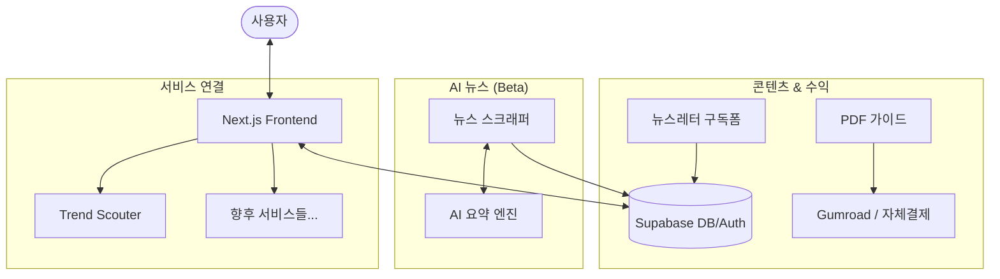

# PRD (Product Requirement Document) - gonsuit.com

## 1. 프로젝트 개요 및 목표
gonsuit.com은 다수의 마이크로 SaaS 서비스를 개발·수익화하는 **허브 사이트**입니다. 단순한 포트폴리오가 아니라, 각 서비스의 신뢰 기반을 제공하면서 동시에 자체적으로 수익을 창출하는 독립적인 플랫폼으로 운영합니다.

- **핵심 목표**: 운영 중인 서비스들의 신뢰 허브 역할 수행 + 콘텐츠(PDF 가이드, 바이브코딩 팁, AI 뉴스) 기반 자체 수익 창출.
- **정체성**: "글로벌 트렌드를 가장 빠르게 한국 창업가·개발자의 언어로 번역하는 곳"
- **운영 원칙**: Zero-cost 인프라 우선 → 수익 발생 후 유료 서비스 단계적 도입.

---

## 2. 전략적 포지셔닝 및 차별화

기존 포트폴리오 사이트 또는 링크 허브 사이트와의 차별화를 위해 다음 전략을 채택합니다.

- **Build in Public**: 서비스 개발 과정과 수익 지표를 투명하게 공개하여 팬층 형성 및 신뢰 구축.
- **콘텐츠 기반 트래픽**: 바이브코딩 팁, AI 뉴스 큐레이션, PDF 가이드 등 SEO 자산 지속 축적.
- **서비스 신뢰 허브**: 외형은 전문적인 브랜드 사이트, 내용은 살아있는 빌딩 스토리로 구성.

---

## 3. 핵심 콘텐츠 및 기능 구성

### 페이지 구조
```
gonsuit.com
├── /            → 비전 + 서비스 목록 + 최근 빌딩 스토리 요약
├── /services    → 운영 중인 서비스 카드 목록 (상태: 운영/베타/준비중)
├── /lab         → 바이브코딩 팁 + 개발 인사이트 블로그
├── /ai-news     → AI 뉴스 큐레이션 (Beta) - 추후 별도 서비스 분리 예정
├── /resources   → PDF 가이드 판매 (Gumroad 연동 or 자체 결제)
├── /about       → gonsuit의 철학, 운영 방식, 로드맵
└── /privacy     → 공용 개인정보처리방침 (서비스별 추가 고지 포함)
```

### 홈페이지 구성 섹션 (구현 완료)
| 섹션 | 내용 |
|------|------|
| Hero | 슬로건 + 핵심 지표(서비스 수, 분석 트렌드 수, MVP 기간) + CTA 버튼 2개 |
| Services | 운영 중인 서비스 카드 (상태 뱃지: 운영중 / 베타 / 준비중) |
| Building Stories | Build in Public 타임라인 (날짜 · 제목 · 태그 · 설명) |
| Resources | PDF 가이드 상품 카드 (가격 · 출시 예정 뱃지) |
| Newsletter | 이메일 구독 폼 |
| AI News Preview | Beta 배너 + 뉴스 페이지 링크 |

### 자체 수익 채널
1. **PDF 가이드 판매**: "0원으로 마이크로 SaaS 만드는 법" 등 실전 가이드 (단건 $5~$15)
2. **뉴스레터 구독**: 무료 구독 → 프리미엄 전환 (추후)
3. **AI 뉴스 서비스**: Beta 운영 후 별도 서비스 분리 및 수익화

### AI 뉴스 기능 분리 기준 (사전 정의)
| 지표 | 현재 | 분리 기준 |
|------|------|-----------|
| 월 방문자 | - | 1,000명 이상 |
| 뉴스레터 구독 | 0명 | 100명 이상 |
| 평균 체류 시간 | - | 2분 이상 |

위 지표 중 2개 이상 충족 시 별도 서비스(`ainews.gonsuit.com` 또는 독립 도메인)로 분리.

---

## 4. 수익화 및 성장 전략

- **단기**: PDF 가이드 Gumroad 연동 → 수동 결제로 즉시 수익 검증
- **중기**: 뉴스레터 구독자 축적 → 프리미엄 구독 전환 테스트
- **장기**: AI 뉴스 서비스 분리 + 멘토링/컨설팅 패키지 도입

### 리텐션 전략
- 정기적인 빌딩 스토리 업데이트로 재방문 유도
- 뉴스레터로 커뮤니티 기능 대체 (초기 커뮤니티 게시판 미도입)
- 커뮤니티 도입은 뉴스레터 구독자 300명 달성 후 재검토

---

## 5. 서버 구성도



### 기술 아키텍처 (Technical Stack)
- **Frontend**: Next.js 14 (App Router) + Tailwind CSS (Vercel 호스팅)
- **UI 컴포넌트**: shadcn/ui (Radix UI 기반)
- **Database/Auth**: Supabase (PostgreSQL & GoTrue)
- **AI 뉴스 엔진**: Gemini API / Claude API (요약 및 인사이트 자동화)
- **결제**: Gumroad (초기) → Stripe / PortOne (수익 검증 후)

### UI 디자인 시스템
shadcn/ui `https://ui.shadcn.com/create?preset=ac8UbVQ` 기준으로 적용.

| 항목 | 선택값 | 비고 |
|------|--------|------|
| Style | Maia | 미니멀·모던 레이아웃 |
| Base Color | Zinc | 세련된 그레이톤, 테크 느낌 |
| Theme | Indigo | 신뢰감·전문성, AI/테크 서비스 최적 |
| Font | Inter | 가독성 최고, 테크 스타트업 표준 |
| Radius | 0.625rem | 부드러운 모서리 |

### 프로젝트 디렉토리 구조
```
gonsuit/                        ← 웹루트 (E:\Work_Gon\260309_gonsuit\gonsuit)
├── src/
│   ├── app/
│   │   ├── globals.css         ← shadcn CSS 변수 (Light / Dark 모드)
│   │   ├── layout.tsx          ← Inter 폰트 + 공통 메타데이터
│   │   └── page.tsx            ← 홈페이지 (6개 섹션 구현)
│   ├── components/
│   │   └── ui/                 ← shadcn 컴포넌트 추가 위치
│   └── lib/
│       └── utils.ts            ← cn() 유틸 함수
├── public/                     ← 정적 에셋
├── package.json
├── tailwind.config.js
├── next.config.js
└── tsconfig.json
```

---

*참조 및 연동: [2.PDP.md](./2_PDP.md)*
