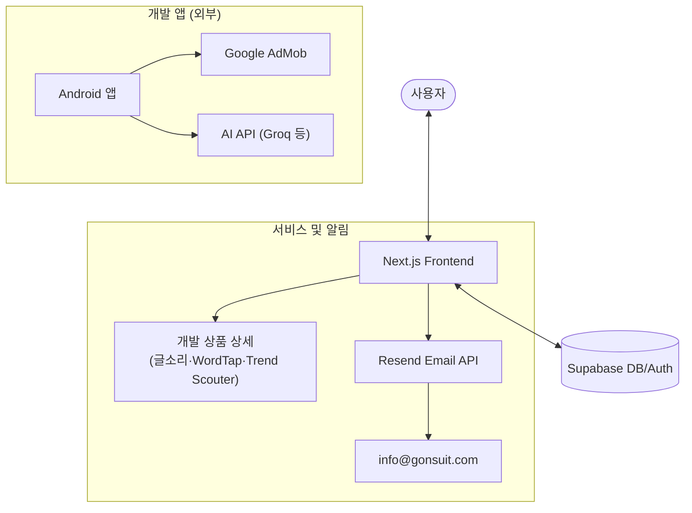

# PRD (Product Requirement Document) - 고앤슈트 (Go & Suit)

> **이 문서의 범위**: 제품이 **왜/무엇**인가(정체성·포지셔닝·요구사항·수익 방향)만 다룬다.
> 기술 스택·디렉토리·페이지 구조·개발 상품의 **현재 상태**는 `CLAUDE.md`가 단일 진실원(SSOT)이다. 중복 기술 금지.

## 1. 프로젝트 개요 및 목표
고앤슈트(Go & Suit)는 고객의 상상을 현실로 만드는 기술력 기반의 **마이크로 SaaS 및 AI 솔루션 개발 전문 기업**의 사이트입니다. 단순한 포트폴리오를 넘어, 고앤슈트가 개발한 상품들의 신뢰 허브 역할을 수행하며 비즈니스 솔루션을 제안합니다.

- **도메인**: `https://gonsuit.com`
- **핵심 목표**: 기업 브랜드 신뢰도 구축 + 개발 상품(글소리·WordTap·Trend Scouter 등) 소개 및 세일즈 + 글로벌 확장성 확보.
- **정체성**: "상상을 기술로 현실화하는, 비즈니스 가치 창출 기술 파트너"
- **운영 원칙**: 국내 고객 중심의 신뢰도 확보 → 영문 대응을 통한 글로벌 확장 준비 → 고도화된 솔루션 제안.

> 개발 상품별 현재 출시 상태·패키지·Play Store 링크는 `CLAUDE.md > 개발 상품(앱) 현황` 참조.

## 1.1 글로벌 대응 전략 (i18n)
- **전략**: Bilingual(국문/영문) 구조 채택.
- **실행**: 국문 사이트를 기본으로 구축하되, 글로벌 파트너 및 고객을 위해 핵심 영역(Header, Hero, Product Info)의 En/Kr 전환 기능을 제공.

---

## 2. 전략적 포지셔닝 및 차별화

기존 포트폴리오 사이트 또는 링크 허브 사이트와의 차별화를 위해 다음 전략을 채택합니다.

- **전문적인 브랜드 이미지**: 외형은 세련된 기업 브랜드 사이트, 내용은 실질적인 기술력과 상품 라인업으로 구성.
- **Bilingual 확장성**: 국내외 고객 모두에게 대응 가능한 유연한 다국어 구조.
- **상품 중심 콘텐츠**: 뉴스나 단순 블로그보다 "우리가 무엇을 만들고 어떤 가치를 주는가"에 집중.

---

## 3. 핵심 콘텐츠 및 기능 구성

> 실제 페이지 경로·디렉토리·구현 상태는 `CLAUDE.md`가 소유한다. 아래는 **콘텐츠 의도**만 기술한다.

### 콘텐츠 축(요구사항)
- **홈**: 비전 + 개발 상품 라인업(상태 뱃지: 운영중/출시예정/준비중) + Build in Public 빌딩 스토리 + 협업 문의 CTA.
- **개발 상품 상세**: 자체 개발 앱(글소리·WordTap 등)마다 독립 상세 페이지로 신뢰·세일즈 채널 확보.
- **협업 문의**: Supabase 저장 + Resend 알림.
- **기술 블로그(Lab)**: AI·SaaS 인사이트로 SEO 트래픽 유입.
- **개인정보처리방침**: 회사 공용 + 앱별(광고·AI·국외이전) 고지.

### 자체 수익 채널
1. **개발 앱 광고 수익**: 글소리·WordTap 등 Google AdMob 기반 무료 앱.
2. **SaaS 구독**: Trend Scouter 등 유료 전환.
3. **트렌드 분석 리포트 (추후 고려)**: Trend Scouter 연계 프리미엄 리포트.

> ~~PDF 가이드(Gumroad) 판매~~ 는 초기 검토 후 보류. `/resources` 페이지 제거됨(→ `/lab` 리다이렉트).

---

## 4. 수익화 및 성장 전략

- **단기**: 브랜드 신뢰도 구축 + 개발 앱(글소리·WordTap) 다운로드·광고 수익 확보.
- **중기**: Trend Scouter 유료 전환 및 앱 라인업 확장.
- **장기**: 멘토링/컨설팅 패키지, 프리미엄 비즈니스 리포트, 자동화 솔루션 B2B화(→ `4_LRP.md`).

### 리텐션 전략
- 정기적인 빌딩 스토리 업데이트로 재방문 유도.
- 기술 블로그(/lab)를 통한 SEO 최적화 및 검색 트래픽 지속적인 유입.

---

## 5. 서버 구성도 (개념)

```mermaid
flowchart TD
    User([사용자]) <--> Frontend[Next.js Frontend]
    Frontend <--> Supabase[(Supabase DB/Auth)]

    subgraph "서비스 및 알림"
        Frontend --> Products["개발 상품 상세<br/>(글소리·WordTap·Trend Scouter)"]
        Frontend --> Resend[Resend Email API]
        Resend --> AdminEmail["info@gonsuit.com"]
    end

    subgraph "개발 앱 (외부)"
        AndroidApp[Android 앱] --> AdMob[Google AdMob]
        AndroidApp --> AI["AI API (Groq 등)"]
    end
```

> 기술 스택·UI 디자인 시스템(shadcn Maia/Zinc/Indigo/Inter)·디렉토리 구조·환경변수는 **`CLAUDE.md`가 단일 진실원**이다. 여기서 중복 기술하지 않는다. (웹루트: 저장소 루트 기준 `gonsuit/`)

---

*연동 문서: 현재 구현·상품 상태 → `CLAUDE.md` / 장기 전략 → `4_LRP.md` / 런칭 기록 → `2_PDP.md`*
